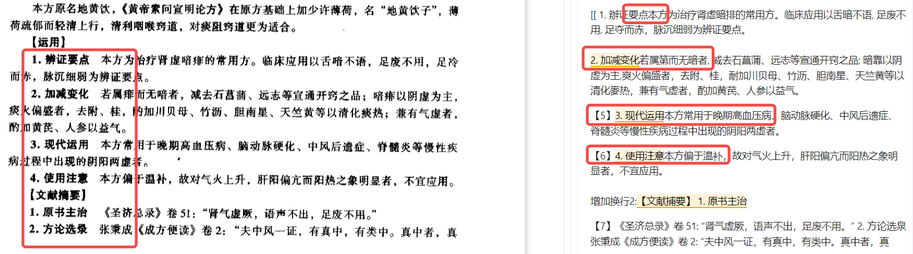

### 1. 无关文本
1.1 句首句尾出现的无关数字，例如：
- /21 111 ⑦室率级慢且不规则,平均室率＜50 次/min
- (二) 体格检查委点 411

1.2 一些模糊的角标，例如：
- 『6』、[611、『』、‘9’

补充正则：```[r'([\[『‘]( *\d+ *)?[』’\]]?)', r'删除35：<u>\1</u>']```

1.3 标点符号重复，例如：
- 不吐之吐 , 其意更深 " . " . "（目前没找到好的解决方法）


以前处理一些无关文本时有无空格用\s？表示不够严谨，用空格*代替。


### 2. 多余换行

2.1 （1）（2）（3）...这种序号类型的文本在正文中为一段，正则处理缺少换行时给他换行了，造成多余换行。介于后处理对换行问题补充处理了，此正则可以考虑不要了。

```[r'([;；。！，,] ?)([\(（]\d[）\)] ?)', r'\1\n增加换行1:\2']```

2.2 原增加换行的正则```[r'[。\u4e00-\u9fa5] *(\d{1,2}\.)', r'\n\1']```，会造成```[。\u4e00-\u9fa5]```匹配的内容缺失，修改补充```[r'([。\u4e00-\u9fa5] *)(\d{1,2}\.)', r'\1\n增加换行10:\2']```。

对于多余换行的问题，后处理对换行问题补充处理了，基本规避了需要换行的地方，以前的增加换行的正则需要在判断测试一下是否保留，后续出现新的换行的问题在进行补充处理。

2.3 原增加换行的正则```[r'(\u4e00-\u9fa5\s{3,}|。|？|！)(\d\.(\d{1,2}\.){0,10}\d?)(\s{1,10}[^\da-zA-Z\|%])', r'\1\n增加换行6:\2\3']```，保留捕获组错误，补充修改与```[r'([。\u4e00-\u9fa5] *)(\d{1,2}\.)', r'\1\n增加换行10:\2']```合并为```[r'([\u4e00-\u9fa5。？！)] *)(\d\.(\d{1,2}\.){0,10}\d?)( {1,10}[^\da-zA-Z\|%])', r'\1\n增加换行6:\2\4']```。

2.4 原增加换行的正则```[r'([:：]\s?)(\d+[\.、]\s?[\u4e00-\u9fa5])', r'\1\n\2']```，\s?会造成多于换行，修改为```[r'([:：] *)(\d+[\.、] *[\u4e00-\u9fa5])', r'\1\n增加换行1:\2']```。


### 3. 缺少空格-中文
文本中应当有空格的情况被删除了，例如：


定位原因由step2_rm_kongge函数造成。可以考虑删除或修改函数。
